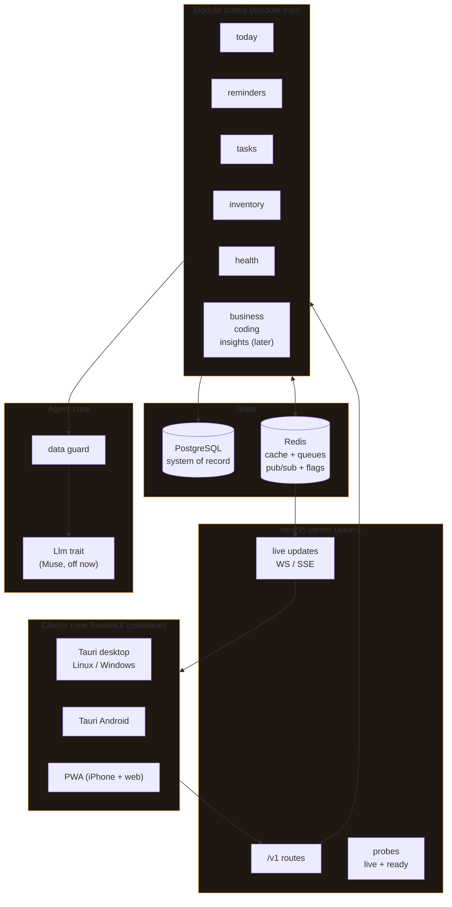

```mermaid
flowchart TB
    subgraph clients["Clients (one SvelteKit codebase)"]
        TAURI_DESK["Tauri desktop<br/>Linux / Windows"]
        TAURI_AND["Tauri Android"]
        PWA["PWA (iPhone + web)"]
    end

    subgraph server["hearth-server (axum)"]
        V1["/v1 routes"]
        LIVE["live updates<br/>WS / SSE"]
        PROBE["probes<br/>live + ready"]
    end

    subgraph mods["Module crates (Module trait)"]
        TODAY["today"]
        REM["reminders"]
        TASK["tasks"]
        INV["inventory"]
        HEALTH["health"]
        MORE["business<br/>coding<br/>insights (later)"]
    end

    subgraph store["State"]
        PG[("PostgreSQL<br/>system of record")]
        REDIS[("Redis<br/>cache + queues<br/>pub/sub + flags")]
    end

    subgraph agent["Agent core"]
        LLM["Llm trait<br/>(Muse, off now)"]
        GUARD["data guard"]
    end

    clients --> V1
    LIVE --> clients
    V1 --> mods
    mods --> PG
    mods <--> REDIS
    REDIS --> LIVE
    mods --> GUARD
    GUARD --> LLM

    style clients fill:#1e1712,stroke:#e8a04c
    style server fill:#1e1712,stroke:#e8a04c
    style mods fill:#1e1712,stroke:#e8a04c
    style store fill:#1e1712,stroke:#e8a04c
    style agent fill:#1e1712,stroke:#e8a04c
```
